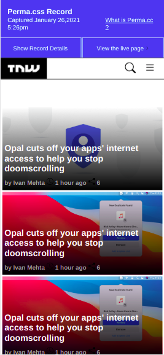
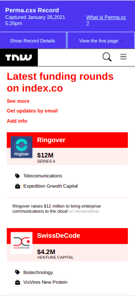
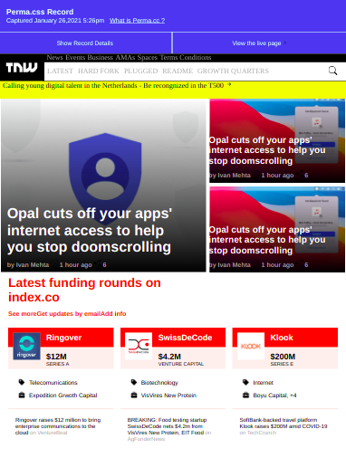
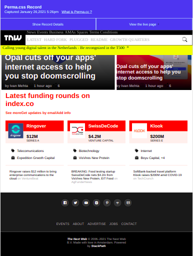
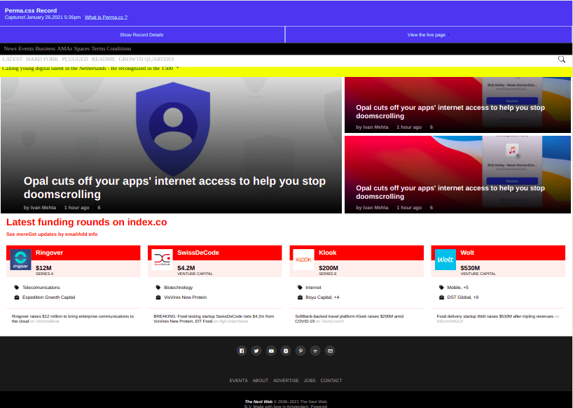
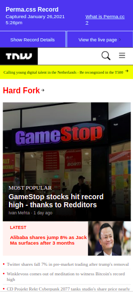
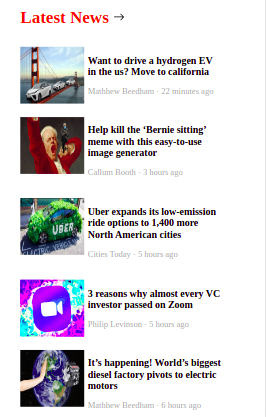
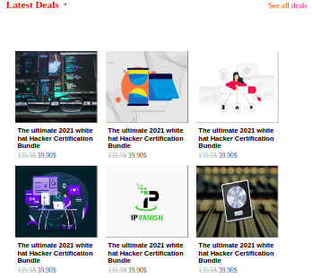
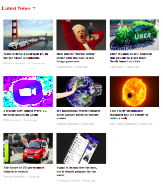

# Perma | TNW

> Perma clone that provide most technology news that you need to know in the easiest way .

The next project is to check out more about Responsive design and how to apply mobile-first techniques, this website was created using flexbox and good practices. We've included flexbox and good practices to build, with responsive design, a simple website clone of The Next Web in Perma.cc.

Mobile Version :

Tablet Version :

Desktop Version :

In Milestone 2 we build the rest of the project that contain categories section,latest news section and latest deals, in this part we used new practice which is css grid .

Mobile Version :

Tablet Version :

Desktop Version :

## Built With 🔨

- HTML5
- CSS
- Visual Studio Code
- Git & Github

## Live Demo 👀

[Live Demo Link](https://hamdiheb.github.io/perma_clone/)

### Install

To get a local copy up and running follow these simple example steps.
- Open terminal
- Clone this project by command git clone https://github.com/hamdiheb/perma_clone.git
- Cd perma-clone folder
- Open index.html in browser

## Getting Started 
- Index.html is the main marke up that will show as the first page in the browser .
- In css folder you will find the css file that contain all applicated designing on this project .
- Img folder contain most of pictures that has been in use for this project

### Prerequisites

- IDE to edit and run the code (We've used Visual Studio Code 🔥).

### Usage

- For anyone who wants to practice HTML5 and CSS responsive design.
- How to apply responsive desing using flexbox and good practices.

## Author

👤 **Iheb Hamdi**

- GitHub: [@hamdiheb](https://github.com/hamdiheb)
- Twitter: [@hamdiheb](https://twitter.com/hamdiheb)
- LinkedIn: [Iheb Hamdi](https://www.linkedin.com/in/iheb-hamdi-b66084152/)

## Author

👤 **Dante Alonso Hernández Tapia**

- GitHub: [@DanteAlonsoHT](https://github.com/DanteAlonsoHT)
- Twitter: [@dante_dante1](https://twitter.com/dante_dante1)
- LinkedIn: [Dante Alonso](https://www.linkedin.com/in/dante-hernandez99/)

## 🤝 Contributing

Contributions, issues, and feature requests are welcome!

Feel free to check the [issues page](https://github.com/hamdiheb/perma_clone/issues).

## Show your support

Give a ⭐️ if you like this project!

## Acknowledgments

- Hat tip to anyone whose code was used 🔰
- Inspiration 💘
- Microverse program ⚡
- My standup team 🏹

## 📝 License

This project is [MIT](./MIT.md) licensed.
